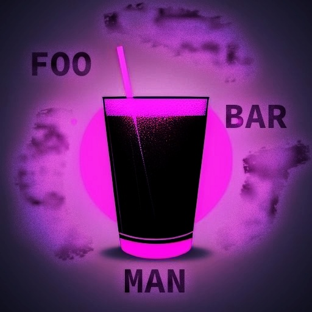
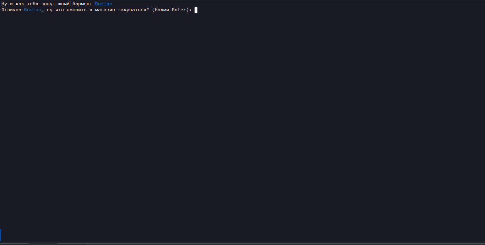
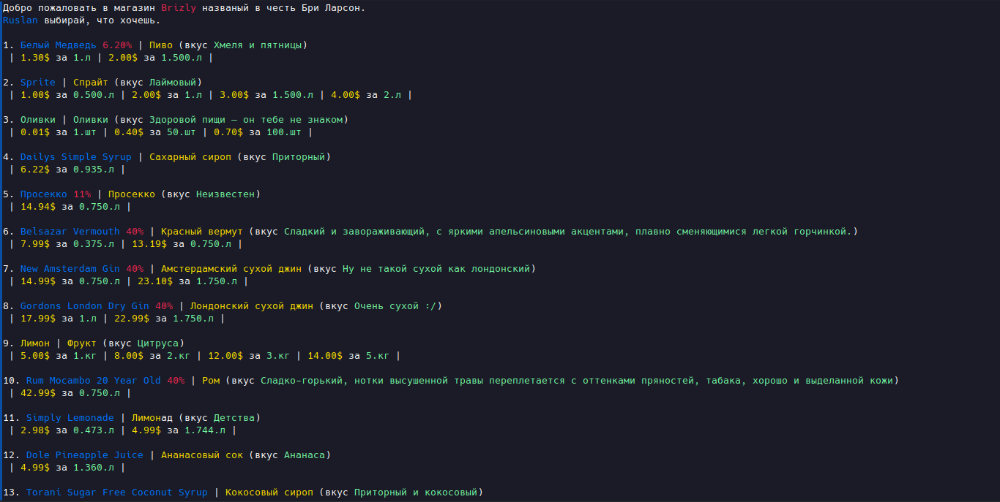
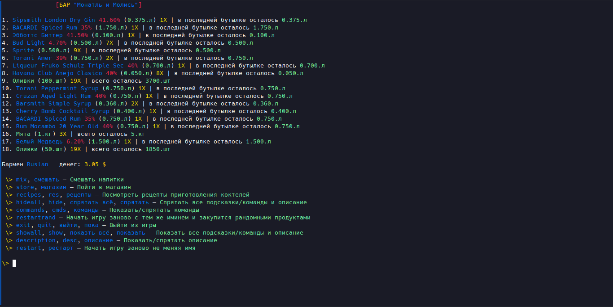

# Simulator barman "Foobarman" (cli-game)

  

## Description

Welcome, this repo with cli-game that show what its like to be a bartender  
and maybe even teach you somthing else.

All control on the command line - hints are present.

Look, if you want playing this game,  
then run execute file called like "foobarman" (linux) or "foobarman.exe" (windows)  

First thing you need to do its select name for your bartender.  
Second thing its shoping in the store, choose the right ingredients, you only have three hundred bucks.  
And now the real game begins... 

### Screenshots

  

  

  

> TODO later there will be more screenshots and more detailed instructions for the game.

## References

Most of the information is taken from open sources. In particular from the sites:
- https://ru.inshaker.com (most cocktail recipes, their description and description of drinks)
- https://drizly.com (Most drinks, their prices and thier descriptions)

## Not Malware 

- foobarman.exe (windows v0.2.6) virustotal: https://www.virustotal.com/gui/file/c125e8074b702aef19ada9734d79ff3c2f654ee139ab3eb3278788a8a117a8b0?nocache=1)
- foobarman (linux v0.2.6) virustotal: https://www.virustotal.com/gui/file/c125e8074b702aef19ada9734d79ff3c2f654ee139ab3eb3278788a8a117a8b0

If you wish, you can check it yourself.  
When uploading a file to virustotal, it asks for a password (I don't know why) — there is no password,  
just leave the fields empty and press confirm.  

## Copyright

| /***************************************************** ******  
| * Copyright (C) 2023 Ruslan <devllartone@gmail.com>  
| *  
| * Cli-Game "Foobarman" is free to play.  
| ******************************************************* *****/

## PS 

The source code is closed so as not to spoil the impression of the game,   
since there are many non-typical situations,  
knowing which in advance you will not get such pleasure from the game  

## Technical information

Game version: 0.2.6  
Main development language: Go (Golang)  
Golang version: 1.19  
